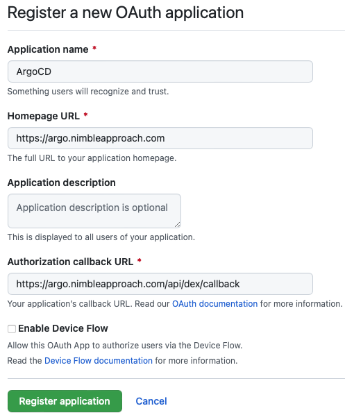
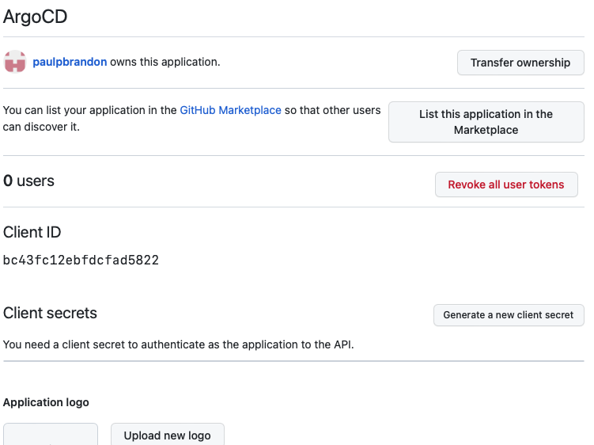

# devops-terraform
Demo for terraforming Argo, Drone and deploying applications into them.

There are currently two pipelines:
- terraform - Sets up the initial infrastructure
- terraform_drone_setup - (Needs renaming) Sets up applications and pipelines in Argo and Drone

This split exists as the Argo and Drone providers cannot work without those apps being in place

## Pre-requisites
Certain steps can't be terraformed and need to be carried out prior to running this pipeline

### Azure DevOps Service Connection
If deploying from Azure DevOps, as it currently stands, when you create the service connection from Azure DevOps, you will also need to assign it another role so that it can assign roles itself e.g. For ACR Pull.

There may be better ways, but the quick way is to do this:
`az role assignment create --assignee "{objectid}" --role "User Access Administrator" --subscription "{subscriptionid}"`

Could create a role with *"Microsoft.Authorization/roleAssignments/write"* and *"Microsoft.Authorization/roleAssignments/delete"* and assign that instead

### Argo GitHub integration
You will need to create an OAuth application within GitHub with access to the relevant Organisations.

This allows those with GitHub access to access Argo, levels of access are governed by membership of GitHub groups:

- In GitHub go to your account settings (from menu top right)
- Select *Developer Settings* from the bottom of the menu on the left.
- Select *OAuth Apps* on the right and hit the *New OAuth App* button
- Fill out the form as follows, replace the host name as necessary (in this demo we are using argo.paulpbrandon.uk):

  
- You will then see something like this when you register the app:

  
- Take note of the client id
- Click the *Generate a new client secret* button, and note down the value you get back (you won't be able to get it later)
- The client and secret values will correspond to the *argo_github_client_id* and *argo_github_client_secret* values in tfvars

### Drone GitHub integration
You will need to do exactly the same as above but for Drone, in order to allow it to build from GitHub repositories.
- The homepage will be https://drone.paulpbrandon.uk
- The callback will be https://drone.paulpbrandon.uk/login
- Again note the client and secret ids and store securely
- The client and secret values will correspond to the *drone_github_client_id* and *drone_github_client_secret* values in tfvars

### Drone token
The pipeline will create an initial drone user that we can then use with the argo provider. 

The token for this user can be generated up front with:
`openssl rand -hex 16`

Store this value securely, this value will go into the **drone_admin_token** variable in tfvars.

**Additional Note:** There are some steps in the drone provider that require the user to be an actual GitHub user e.g. drone_repo resources.
We can do this by specifying the username as one matching a suitable account instead of machine_admin or upgrade an account afterwards with:

`drone user update paulpbrandon --admin`

You may then use this user's token in the following pipeline if you want automatic repo activation, otherwise you'll need to activate in the drone UI

## Pre-requisites for setup pipeline
These are the steps you should carry out before running the second setup pipeline for the first time


### Azure DevOps Service Connection
If using Azure DevOps, the service user will need permission to create an Azure AD application.
- This is currently critical for drone to write an image to ACR
- It is also needed if the OAuth proxy is in use

The necessary role can be set via the Graph API or in Portal (that is, if you have permissions yourself to add AD roles to a Service Principal!).
These are not the same set of roles that be set via *az role assignment* as above

The command below would add the *Application Developer* built in role (**not yet tested if this is enough as I currently have the above permission problem!**)
```shell
az rest --method POST --uri 'https://graph.microsoft.com/beta/roleManagement/directory/roleAssignments' --body '{"principalId": "3632d5cd-664d-4fc9-a1e0-830b16e97d0e", "roleDefinitionId": "cf1c38e5-3621-4004-a7cb-879624dced7c", "directoryScopeId": "/"}'
```

### DNS
With creating DNS Zone (or similar) as a resource, then it is likely you may need to update the name servers associated with the domain (as defined in DNS Zone).
The Argo and Drone providers will not work if the alias entries cannot be resolved. So there will be a dependency on DNS propagation.

It may be advisable to create the zone separately, and bring in as a data resource as destroying and recreating is liable to change the Azure name servers it is attached to

### Argo restart
It seems to be advisable to hard restart a couple of services after the first pipeline has been run ***for the very first time*** otherwise you may get strange behaviour with Argo SSO:
- `kubectl scale deployment argocd-server --replicas=0 -n argocd`
- `kubectl scale deployment argocd-dex-server --replicas=0 -n argocd`
- Then bring back however many replicas you need

### Login to Drone and Argo
Ensure the GitHub integration works and sort out any final authorisation that may need to be carried out.

There may be a possible issue with the update of argocd-cm in this pipeline and may give a 404 on login, if this happens you'll need to fetch the argocd-cm and apply it directly with kubectl, assuming the callback URL is correct in GitHub

### Argo SSH key
We are configuring Argo to connect to GitHub repositories via SSH, we are going to encrypt it so that it can be stored in this repo safely
- Install kubeseal - `brew install kubeseal`
- Get credentials for cluster - `az aks get-credentials`
- Generate a new key/value pair (e.g. with ssh-keygen)
- Add the public key to a suitable user in GitHub
- Copy this file [argo-github-repo.yaml](./templates/argo-github-repo.yaml)
- Change the repository accordingly and add the private key
- Run `kubeseal --format=yaml <argo-github-repo.yaml >sealed-argo-repo-secret.yaml`
- Copy the **sealed** file into the **secrets** directory and commit this repo (if there are any secrets there already they won't work and file can be removed)

### Argo token
A token is required for the Argo provider to connect to Argo, this can only be done once Argo is deployed. 

This pipeline will create a machine user, but it will not have a token. To get a token:
- Log into Argo
- Navigate to `https://argo.paulpbrandon.uk/settings/accounts/machine` (replace host as necessary)
- Select *Generate New* in the middle of the page (you will need to be part of what GitHub group has been defined as the admin group in Argo this corresponds to the *argo_github_admin_group* variable in tfvars)
- An expiry can be set, but it does mean the pipeline will periodically stop working until you set a new one
- Take note of the token and store securely, this corresponds to **argo_token** variable in tfvars

### Drone metrics user
We can only seemingly create one account up front for drone, we could use the admin account to access metrics, but it may not be a good idea.

So we'll create a new one, the plan was for the drone provider to create the user and inject the token automatically, however, the user create does not appear to return a token value, therefore create one with the drone CLI e.g.
- `drone user add metrics_user --machine --token=8535d5b6d00da0f9eaa03ffdd72afex9`
And add this to the variable *drone_metrics_token*

## Adding applications to Argo
Argo will get the manifest for an application from a git repo. See the [applications.tf](./terraform_drone_setup/applications.tf) file for an example of how to add them from this pipeline.

This demo will currently deploy 2 versions of a helloworld app as defined in https://github.com/nimbleapproach/argo-demo/tree/main/kustomizehelloworld.

Note, if we wish to use a webhook to trigger Argo when the argo repo is changed we'll need to add that to GitHub manually. By default, Argo checks the repo every 3 minutes.

If you have pre-existing apps when adding to Argo, their image will need to be copied to the appropriate ACR, or simply trigger a new build in Drone, to do it